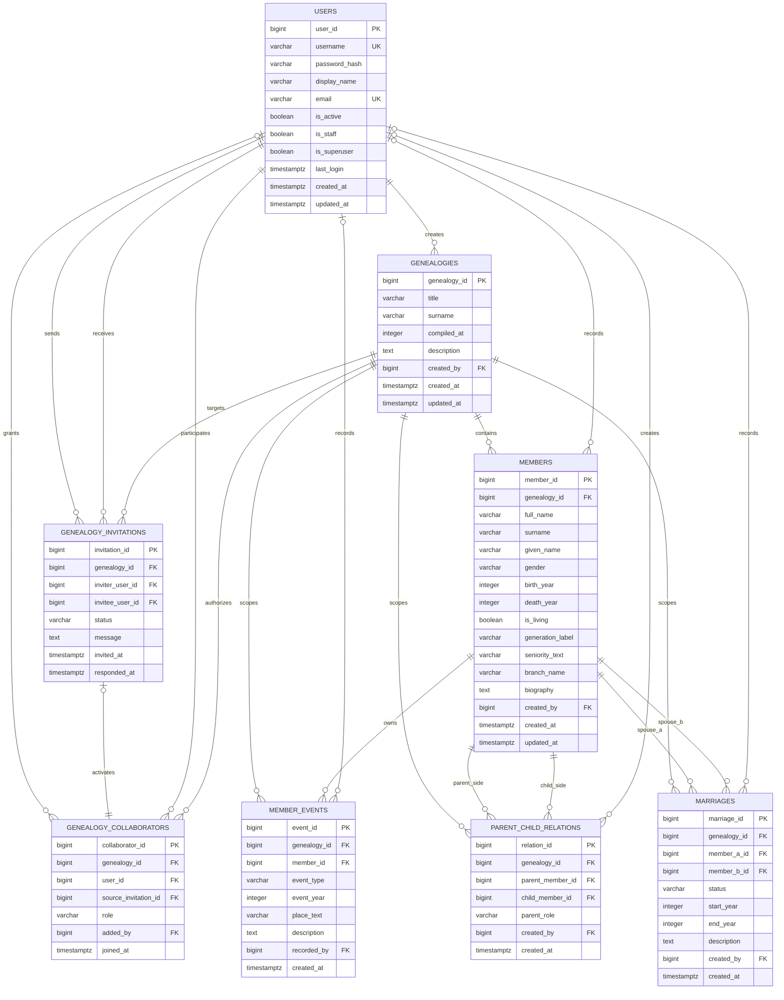

# "寻根溯源" 族谱管理系统数据库设计

## 1. 设计目标

本设计面向课程一期落地，目标是同时满足：

- 课程要求中的 ER 图、关系模式转换、3NF/BCNF 分析、主键/外键/约束设计
- 后续 Django + PostgreSQL 开发的直接可实现性
- 大规模数据生成、递归查询、性能优化与实验验收材料准备

本期采用以下固定原则：

- `genealogy` 是权限和数据隔离的核心边界，一个族谱对应一个家族
- 数据库只存储基础事实关系，不存储兄弟、祖孙、叔侄等派生亲属关系
- 代际层级通过递归查询推导，不作为事实字段落库
- 生卒事实以 `members` 为唯一事实源，成员事件只承载扩展档案，避免跨表重复
- 成员主档与成员事件分离，完整档案通过 `members + member_events` 组合表达
- 协作权限拆分为“邀请流转”和“实际协作关系”两层

## 2. 需求梳理结果

### 2.1 核心业务对象

- 用户：注册、登录、身份识别、创建族谱、接受邀请
- 族谱：谱名、姓氏、修谱时间、创建者、描述信息
- 协作：邀请他人维护族谱，维护协作者列表
- 成员：成员主档、生卒信息、分支信息、生平简介
- 成员事件：出生、死亡、迁徙、居住、任职、成就、安葬、婚配记载等
- 亲子关系：仅存父母与子女的基础边
- 婚姻关系：记录成员之间的配偶/婚姻事实

### 2.2 建模关键约束

- 成员不能靠姓名唯一识别，必须使用稳定的 `member_id`
- 所有成员关系必须限制在同一 `genealogy` 内
- 树形预览、祖先查询、亲缘路径查询都依赖递归关系查询能力
- 模糊姓名查询与“父节点查子节点”必须有明确索引策略
- 一期不引入 `families`、`locations`、`media`、`sources` 等额外实体，避免模型过度膨胀

## 3. 概念结构与 ER 分析

### 3.1 核心实体

本期识别出 8 个核心实体：

1. `users`
2. `genealogies`
3. `genealogy_invitations`
4. `genealogy_collaborators`
5. `members`
6. `member_events`
7. `parent_child_relations`
8. `marriages`

### 3.2 ER 图

下图采用 Mermaid `erDiagram` 描述实体、属性与联系基数，可直接用于文档渲染；单独的图文件见 [er-diagram.mmd](/g:/WHU-CSLab-DB-Genealogy/docs/er-diagram.mmd)。



### 3.3 联系与基数说明

| 联系 | 基数 | 说明 |
| --- | --- | --- |
| `users -> genealogies` | 1:N | 一个用户可创建多个族谱，一个族谱只有一个创建者 |
| `users -> genealogy_invitations` | 1:N | 用户既可以发出邀请，也可以接收邀请 |
| `genealogies -> genealogy_invitations` | 1:N | 一个族谱可对应多条邀请记录 |
| `users <-> genealogies` | M:N | 通过 `genealogy_collaborators` 建立协作者授权 |
| `genealogies -> members` | 1:N | 每个成员只归属于一个族谱 |
| `members -> member_events` | 1:N | 一个成员可有多条事件记录 |
| `members <-> members` | M:N | 通过 `parent_child_relations` 表示亲子边 |
| `members <-> members` | M:N | 通过 `marriages` 表示婚姻/配偶关系 |

### 3.4 关键业务规则

- `member_id` 是所有成员查询、关系维护与图路径计算的唯一入口
- 亲缘关系图仅由两类基础边组成：
  - `parent_child_relations`
  - `marriages`
- 兄弟姐妹、祖孙、叔侄、姻亲等关系均由查询推导，不单独落表
- `generation_label` 与 `seniority_text` 用于保存族谱原文中的辈字、排行或称谓，不等价于系统推导出的代数
- 在当前一期语义中：
  - 每个子女最多记录一个 `father`
  - 每个子女最多记录一个 `mother`
  - 每个成员同一时刻最多只能存在一条状态为 `married` 的有效婚姻记录

## 4. 关系模式设计

### 4.1 关系模式总览

```text
users(
  user_id PK,
  username UK,
  password_hash,
  display_name,
  email UK,
  is_active,
  is_staff,
  is_superuser,
  last_login,
  created_at,
  updated_at
)

genealogies(
  genealogy_id PK,
  title,
  surname,
  compiled_at,
  description,
  created_by FK -> users.user_id,
  created_at,
  updated_at
)

genealogy_invitations(
  invitation_id PK,
  genealogy_id FK -> genealogies.genealogy_id,
  inviter_user_id FK -> users.user_id,
  invitee_user_id FK -> users.user_id,
  status,
  message,
  invited_at,
  responded_at
)

genealogy_collaborators(
  collaborator_id PK,
  genealogy_id FK -> genealogies.genealogy_id,
  user_id FK -> users.user_id,
  source_invitation_id FK -> genealogy_invitations.invitation_id,
  role,
  added_by FK -> users.user_id,
  joined_at
)

members(
  member_id PK,
  genealogy_id FK -> genealogies.genealogy_id,
  full_name,
  surname,
  given_name,
  gender,
  birth_year,
  death_year,
  is_living,
  generation_label,
  seniority_text,
  branch_name,
  biography,
  created_by FK -> users.user_id,
  created_at,
  updated_at
)

member_events(
  event_id PK,
  genealogy_id FK -> genealogies.genealogy_id,
  member_id FK -> members.member_id,
  event_type,
  event_year,
  place_text,
  description,
  recorded_by FK -> users.user_id,
  created_at
)

parent_child_relations(
  relation_id PK,
  genealogy_id FK -> genealogies.genealogy_id,
  parent_member_id FK -> members.member_id,
  child_member_id FK -> members.member_id,
  parent_role,
  created_by FK -> users.user_id,
  created_at
)

marriages(
  marriage_id PK,
  genealogy_id FK -> genealogies.genealogy_id,
  member_a_id FK -> members.member_id,
  member_b_id FK -> members.member_id,
  status,
  start_year,
  end_year,
  description,
  created_by FK -> users.user_id,
  created_at
)
```

### 4.2 字段设计说明

| 表 | 字段 | 说明 |
| --- | --- | --- |
| `genealogies` | `compiled_at` | 记录修谱年份，采用年份整数，便于统计 |
| `members` | `full_name` | 完整姓名，用于展示与模糊检索 |
| `members` | `surname` / `given_name` | 支持按姓氏、名拆分分析，也便于后续生成数据 |
| `members` | `is_living` | 区分在世/已故；与 `death_year` 联合约束 |
| `members` | `generation_label` | 保留族谱原文中的字辈或代字 |
| `members` | `seniority_text` | 保留“长子”“次子”“三房”等谱书称谓 |
| `genealogy_collaborators` | `source_invitation_id` | 指向协作关系的来源邀请，保证邀请流转与协作授权可追溯 |
| `member_events` | `event_type` | 事件类型：`migration`、`residence`、`occupation`、`achievement`、`burial`、`marriage_note`、`other` |
| `parent_child_relations` | `parent_role` | 仅允许 `father` / `mother` |
| `marriages` | `status` | 允许 `married`、`divorced`、`widowed`、`unknown` |

说明：

- 为了稳妥接入 Django 认证体系，`users` 表在课程业务字段之外增加了 `is_active`、`is_staff`、`is_superuser`、`last_login`
- 这些字段属于工程化认证支持字段，不改变课程要求中的核心业务建模边界
- `auth_group`、`auth_permission` 及其关联表属于 Django 框架支撑表，不纳入课程业务 ER 主体，但会通过 Django 内置 migration 创建

### 4.3 代际推导口径

为满足课程中的代际统计需求，统一采用以下规则：

- 在单个 `genealogy` 内，将“没有任何已记录父母关系的成员”视为根成员
- 代际深度 `generation_depth` 定义为：从任一根成员到目标成员的最短亲子边长度
- 代际统计类 SQL 一律使用该 `generation_depth` 口径
- 如果某成员因异常数据同时可由不同深度推导得到代际，则查询时取最小深度，并将此类记录视为数据质量问题，在数据校验脚本中单独检查
- `generation_label` 仅保留族谱原文中的辈字信息，不参与课程统计口径

### 4.4 不单独建表的对象

以下对象在一期不升为独立实体：

- `families`：当前与 `genealogies` 合并
- `locations`：地点先作为 `member_events.place_text`
- `media`：配图、扫描件后续再扩展
- `sources`：史料来源二期再建
- `derived_kinships`：派生亲属关系通过 SQL 推导

## 5. 约束设计

### 5.1 主键与候选键

- 所有主表统一使用单列代理主键 `bigint`
- `users.username` 唯一
- `users.email` 唯一
- `genealogy_collaborators(genealogy_id, user_id)` 唯一
- `genealogy_collaborators.source_invitation_id` 唯一
- `parent_child_relations(genealogy_id, parent_member_id, child_member_id, parent_role)` 唯一
- `members(genealogy_id, member_id)` 复合唯一键用于组合外键校验同族谱关系

### 5.2 外键策略

| 关系 | 删除策略 | 设计原因 |
| --- | --- | --- |
| `genealogies.created_by -> users` | `RESTRICT` | 族谱创建者不能被静默删除 |
| `members.genealogy_id -> genealogies` | `CASCADE` | 删除族谱时连带清理谱内数据 |
| `member_events -> members` | `CASCADE` | 删除成员时删除其事件 |
| `parent_child_relations -> members` | `CASCADE` | 删除成员时删除相关亲子边 |
| `marriages -> members` | `CASCADE` | 删除成员时删除相关婚姻边 |
| `created_by/recorded_by/added_by -> users` | `SET NULL` | 保留业务数据，允许操作者账户后续被禁用/清理 |

### 5.3 CHECK 约束

数据库层直接使用 `CHECK` 强制以下规则：

- `birth_year <= death_year`，除非 `death_year` 为空
- `is_living = true` 时 `death_year` 必须为空
- `parent_member_id <> child_member_id`
- `member_a_id <> member_b_id`
- `member_a_id < member_b_id`
  - 通过固定成员顺序避免婚姻边重复记录
- `parent_role IN ('father', 'mother')`
- `gender IN ('male', 'female', 'unknown')`
- `event_type`、`status`、`role` 均限制在定义值域内
- `start_year <= end_year`，除非 `end_year` 为空
- 邀请的 `responded_at` 不能早于 `invited_at`

### 5.4 组合外键与同族谱约束

为了保证“所有关系边必须限制在同一 `genealogy` 内”，本设计不只依赖普通外键，而是使用组合唯一键 + 组合外键：

- `member_events(genealogy_id, member_id)` 引用 `members(genealogy_id, member_id)`
- `parent_child_relations(genealogy_id, parent_member_id)` 引用 `members(genealogy_id, member_id)`
- `parent_child_relations(genealogy_id, child_member_id)` 引用 `members(genealogy_id, member_id)`
- `marriages(genealogy_id, member_a_id)` 引用 `members(genealogy_id, member_id)`
- `marriages(genealogy_id, member_b_id)` 引用 `members(genealogy_id, member_id)`

这样可以在数据库层阻止跨谱成员被错误连边。

### 5.5 触发器约束

下列规则不能可靠地只靠单行 `CHECK` 表达，因此使用触发器完成：

1. 父母出生年必须早于子女
2. 父亲关系对应男性成员，母亲关系对应女性成员
3. 亲子关系写入时不能造成祖先环
4. 发起邀请的用户必须是族谱创建者或具备编辑权限的协作者
5. 协作关系必须来源于同一族谱中一条已接受的邀请记录
6. 同一成员不能同时拥有多条状态为 `married` 的有效婚姻记录

### 5.6 一致性设计决策

为避免后续开发埋雷，以下口径固定：

- `members.birth_year / death_year` 是生卒事实的唯一事实源
- `member_events` 不再存储 `birth`、`death` 两类事件，避免和 `members` 重复
- 如需时间线展示，可在查询层将 `birth_year / death_year` 投影为虚拟事件
- `genealogy_collaborators` 仅表示“已正式生效的协作关系”，必须可追溯到一条已接受邀请
- `genealogy_collaborators.added_by` 允许为族谱创建者、具备编辑权限的协作者，或邀请接受人本人

## 6. 范式分析

### 6.1 总体结论

- 全部关系模式至少满足 `3NF`
- 除 `members` 外，其余主表可按 `BCNF` 解释
- `members` 保留了若干展示型字段，但这些字段都直接依赖主键，不由其他非主属性决定，因此仍满足 `3NF`

### 6.2 各表范式说明

| 表 | 目标范式 | 说明 |
| --- | --- | --- |
| `users` | BCNF | 非主属性只依赖 `user_id`，候选键 `username`、`email` 也不引入传递依赖 |
| `genealogies` | BCNF | 所有属性完全依赖 `genealogy_id` |
| `genealogy_invitations` | BCNF | 邀请状态、时间、消息均只依赖 `invitation_id` |
| `genealogy_collaborators` | BCNF | 协作角色与加入时间只依赖协作关系主键，来源邀请只提供审计链路 |
| `members` | 3NF | `full_name`、生卒年、简介、分支信息等均直接依赖 `member_id`；未存储可由关系推导的代数或派生亲属关系 |
| `member_events` | BCNF | 事件类型、年份、地点、描述只依赖 `event_id` |
| `parent_child_relations` | BCNF | 亲子边事实只依赖 `relation_id` |
| `marriages` | BCNF | 婚姻记录事实只依赖 `marriage_id` |

### 6.3 为什么不落库“代数”和“派生亲属关系”

如果把以下信息作为事实字段持久化：

- `generation_level`
- 兄弟姐妹、叔侄、祖孙、表亲等派生亲属关系

则会带来明显冗余：

- 代际层级可由祖先根节点与递归关系推导
- 派生亲属关系可由基础边做图推导
- 一旦基础边调整，派生表需要级联刷新，维护复杂且容易不一致

因此本设计将它们保留为查询结果，而不是事实表字段。

## 7. 索引设计

### 7.1 基础索引

| 表 | 索引 | 用途 |
| --- | --- | --- |
| `members` | `(genealogy_id, full_name)` | 同谱内精确、排序、前缀查询 |
| `members` | `(genealogy_id, gender)` | Dashboard 中单谱人数与男女比例统计 |
| `members` | `GIN(full_name gin_trgm_ops)` | 中文/模糊姓名搜索 |
| `parent_child_relations` | `(genealogy_id, parent_member_id)` | 父母查全部子女 |
| `parent_child_relations` | `(genealogy_id, child_member_id)` | 子女追溯父母/祖先 |
| `marriages` | `(genealogy_id, member_a_id)` | 成员 A 查婚姻 |
| `marriages` | `(genealogy_id, member_b_id)` | 成员 B 查婚姻 |
| `member_events` | `(genealogy_id, member_id, event_type, event_year)` | 成员时间线与事件筛选 |
| `genealogy_collaborators` | `(user_id)` | 权限页、我的族谱列表 |
| `genealogy_invitations` | `(invitee_user_id, status)` | 我的待处理邀请列表 |

### 7.2 唯一与部分索引

- `genealogy_invitations` 使用部分唯一索引，阻止同一族谱对同一用户存在多条 `pending` 邀请
- `parent_child_relations` 使用部分唯一索引，保证每个子女最多一个父亲、最多一个母亲
- `marriages` 使用部分唯一索引阻止同一成员对存在重复有效婚姻，并配合触发器保证单成员仅存在一条有效婚姻

### 7.3 对课程查询的支撑

| 查询需求 | 主要依赖 |
| --- | --- |
| 查某成员配偶 | `marriages` 双向索引 |
| 查某成员全部子女 | `parent_child_relations(genealogy_id, parent_member_id)` |
| 递归查祖先 | `parent_child_relations(genealogy_id, child_member_id)` |
| 两人亲缘路径 | `parent_child_relations` + `marriages` 组成图边 |
| 姓名模糊查找 | `members` trigram 索引 |
| Dashboard 统计 | `members(genealogy_id)` 与相关聚合 |

## 8. 可执行实现映射

本设计已同步落实到 PostgreSQL 初始化脚本：

- DDL 文件：[sql/001_initial_schema.sql](/g:/WHU-CSLab-DB-Genealogy/sql/001_initial_schema.sql)
- 独立 ER 图文件：[docs/er-diagram.mmd](/g:/WHU-CSLab-DB-Genealogy/docs/er-diagram.mmd)

该 SQL 脚本包含：

- 8 张核心表的建表语句
- 主键、外键、唯一约束、检查约束
- 同族谱组合外键
- 更新时间戳触发器
- 邀请权限校验、协作来源校验、亲子时间校验、亲子环校验、有效婚姻唯一性触发器
- 课程要求对应的基础索引与 trigram 索引

## 9. 后续实现建议

基于当前建模，后续实现建议按以下顺序推进：

1. 用 Django `models.py` 对照 DDL 建立模型
2. 补充样例数据与批量生成脚本
3. 编写课程要求的基础 SQL、递归 CTE 与统计查询
4. 做有索引/无索引的 `EXPLAIN ANALYZE` 对比
5. 最后再补界面和演示流程
